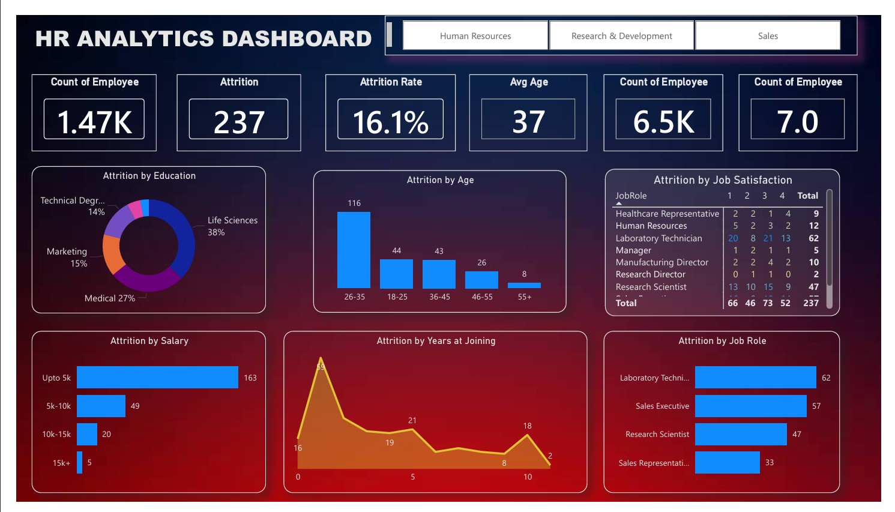

<div align="center">

# 📊 Dashboard using Power BI

### Interactive Business Intelligence Dashboard for Data-Driven Insights


<br/>

<p align="center">
A professional Power BI dashboard project designed to transform raw datasets into meaningful visual insights through interactive reports, KPIs, and analytical storytelling.
</p>

</div>

---

# 📌 Project Overview

This project showcases an interactive **Power BI Dashboard** built to analyze, visualize, and interpret business data effectively. The dashboard provides actionable insights using dynamic visualizations, KPI indicators, filtering options, and trend analysis.

The main goal of this project is to simplify complex datasets into intuitive and user-friendly dashboards that support better business decision-making.

---

# ✨ Features

✅ Interactive and dynamic dashboard  
✅ Data cleaning and transformation using Power Query  
✅ KPI cards for quick business insights  
✅ Trend and performance analysis  
✅ User-friendly visual storytelling  
✅ Slicers and filters for deep data exploration  
✅ Business-focused analytics and reporting  
✅ Clean and professional dashboard design  

---

# 🛠️ Tech Stack

| Tool | Purpose |
|------|----------|
| **Power BI** | Dashboard Development & Visualization |
| **Power Query** | Data Cleaning & Transformation |
| **DAX** | Data Analysis Expressions & Calculations |
| **Excel / CSV Dataset** | Data Source |

---

# 📂 Project Structure

```bash
Dashboard-using-Power-BI/
│
├── Dataset/
│   └── Data files used for analysis
│
├── Dashboard/
│   └── Power BI Dashboard (.pbix)
│
├── Screenshots/
│   └── Dashboard preview images
│
└── README.md
```

---

# 📈 Dashboard Insights

The dashboard helps in:

- Monitoring overall business performance
- Tracking KPIs and trends
- Identifying growth opportunities
- Comparing category-wise performance
- Understanding patterns through interactive visuals
- Supporting data-driven decision-making

---

# 🖼️ Dashboard Preview

## 📍 Main Dashboard

<p align="center">
  
</p>

---

# 🚀 Getting Started

## 1️⃣ Clone the Repository

```bash
git clone https://github.com/AnitaSahoo2002/Dashboard-using-Power-BI.git
```

---

## 2️⃣ Open in Power BI

- Install **Microsoft Power BI Desktop**
- Open the `.pbix` file from the project directory
- Refresh the dataset if required

---

# 📊 Key Power BI Concepts Used

- Data Modeling
- DAX Measures
- Power Query Transformations
- KPI Cards
- Interactive Visualizations
- Slicers & Filters
- Dashboard Design Principles

---

# 🎯 Project Objectives

- Convert raw data into actionable insights
- Build visually engaging dashboards
- Practice real-world business intelligence workflows
- Improve analytical and storytelling skills using Power BI

---

# 📚 Learning Outcomes

Through this project, I gained hands-on experience in:

✔ Data visualization  
✔ Dashboard design  
✔ Data transformation  
✔ Business analytics  
✔ DAX calculations  
✔ Interactive reporting  

---

# 🔮 Future Improvements

- Add advanced forecasting visuals
- Integrate real-time datasets
- Improve mobile dashboard responsiveness
- Add more drill-through analytics pages
- Deploy dashboard to Power BI Service

---

# 🤝 Contributing

Contributions, suggestions, and feedback are always welcome.

If you'd like to improve this project:

1. Fork the repository
2. Create a new branch
3. Commit your changes
4. Open a Pull Request

---

# 📬 Contact

## 👩‍💻 Anita Sahoo

📧 Email: anita.sahoo.careers@gmail.com  
🔗 GitHub: https://github.com/AnitaSahoo2002

---

<div align="center">

### ⭐ If you found this project useful, don't forget to star the repository!

</div>
